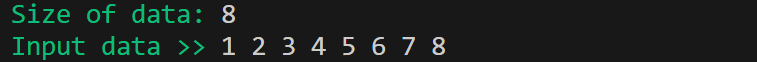
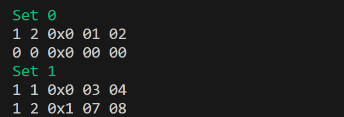
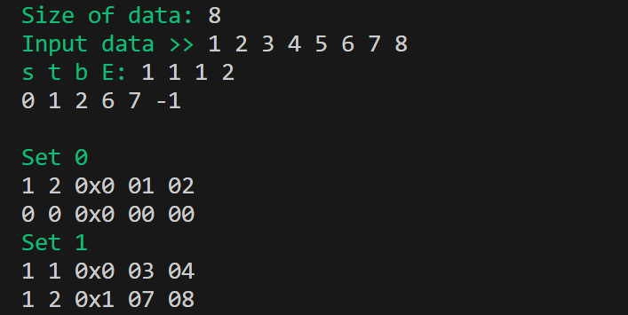

  


# Cache-Simulator 🖥️

🧮 A C program that simulates a memory cache using the LFU replacement policy

## Table of Contents

1. [About](#about)  
2. [Features](#features)  
3. [Requirements](#requirements)  
4. [Installation](#installation)  
5. [Usage](#usage)  

---

## About

This repository contains a C project simulating a memory cache using the LFU replacement policy.  
The project demonstrates basic cache memory concepts including sets, lines, blocks, tags, and cache updates, with a terminal interface to interactively read and write bytes.

---

## Features

- Simulates a memory cache with configurable sets, lines, and block sizes  
- Implements LFU (Least Frequently Used) replacement policy  
- Supports reading bytes from memory into the cache  
- Supports writing bytes to memory and updating the cache (Write-Through)  
- Prints the full cache state with valid bits, frequency counters, tags, and block contents  
- Interactive terminal interface for step-by-step cache simulation

---

## Requirements

- A Linux, macOS, or Windows system with a C compiler (e.g., GCC)  
- Git (to clone the repository)  
- Make (to build the project)

---

## Installation
Follow these steps to set up the project locally:

---

### 1. Clone the repository
```bash
git clone https://github.com/Amit-Bruhim/Cache-Simulator.git
```
### 2. Navigate into the src folder
```bash
cd Cache-Simulator/src
```
### 3. Compile the program using Make
```bash
make
```
### 4. Run the main program
```bash
./cache
```

---

## Usage

When you run the program, you will first be prompted to enter the size of the memory and the data values.  

For example, enter a memory size of **8** and the following data values `1 2 3 4 5 6 7 8`:

  

Next, you will be asked to enter the cache parameters: `s`, `t`, `b`, and `E`.  

These parameters define the structure of the cache:

- **s** → Number of **set index bits** (the cache will have 2^s sets)  
- **t** → Number of **tag bits** (used to identify which memory block is stored in a cache line)  
- **b** → Number of **block offset bits** (the number of bytes in each cache block is 2^b)  
- **E** → Number of **lines per set** (associativity, how many cache lines each set contains)

For example, enter `1 1 1 2`:

  


This configuration creates:

- **2 sets** (2^1)  
- **Tag length 1 bit**  
- **Block size 2 bytes** (2^1)  
- **2 lines per set**

After entering the configuration, you can interactively read bytes by entering their memory offsets.  
Enter a negative number to stop reading.  

For example, enter the offsets `0 1 2 6 7 -1`:

  

Once finished, the program prints the full cache state, showing each set and its lines with:

- **valid bit**  
- **frequency counter**  
- **tag** (in hexadecimal)  
- **block contents** (in hex)  

For example, the cache state will be displayed as:



Finally, after entering all inputs and reading the desired memory offsets, the complete run of the program will look like this:


